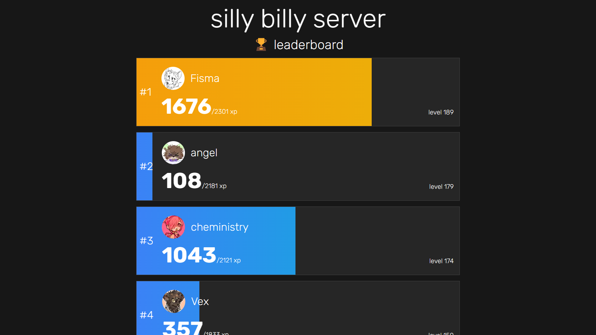

# frostboard

Public leaderboard for a now defunct Discord server, with infinite scrolling.

## Usage

This NextJS app is intended for use with the
[frostbot](https://github.com/Jochem-W/frostbot) Discord bot, and is intended to
run as a Docker container. To get started, fill in the `example.env` file and
save it to `.env`, and run `pnpm install` and `pnpm dev`.

## License

Code in this repository is licensed under the AGPL 3.0 license.
